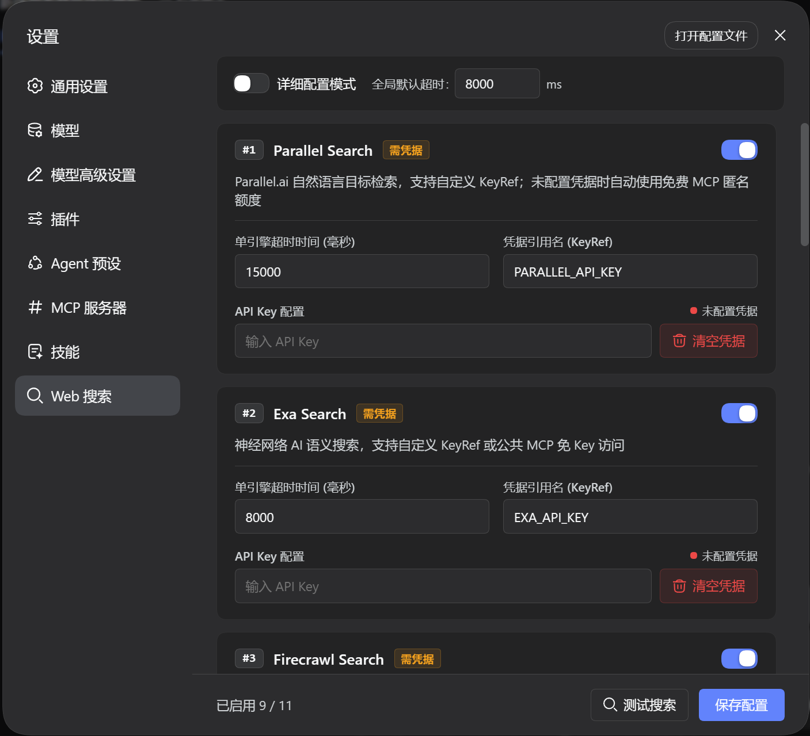
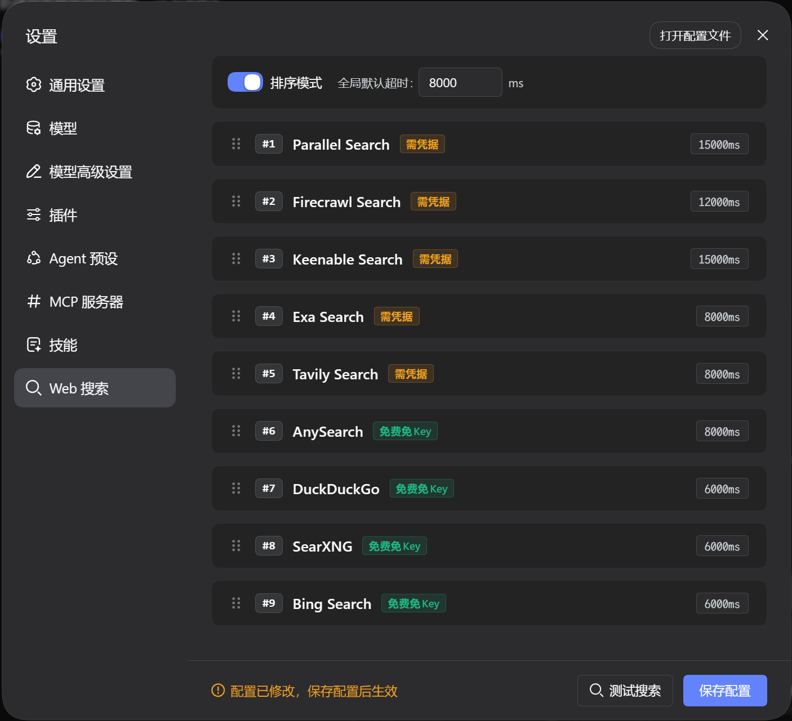
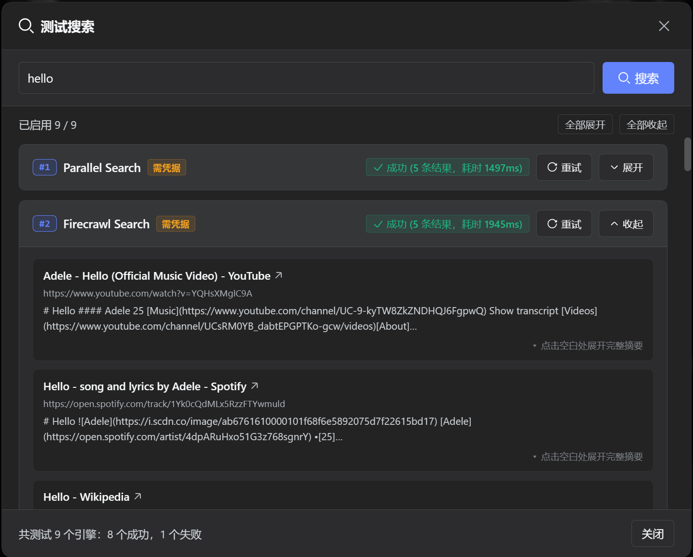

# dsh-cust-search

[](LICENSE)
[](https://github.com/deepseek-ai/deepseek-harness)
[](https://nodejs.org/)

English | [中文](README.zh.md)

Custom Web Search plugin for DeepSeek Harness (DSH) WebUI. Searches through configured engines in order, automatically trying the next engine if one fails or times out.

---

## UI Preview

### 1. Configuration View


### 2. Sorting Mode


### 3. Search Testing


---

## Core Features

- **Sequential Search**: Searches engines one by one in your configured order. If an engine encounters a network error, invalid key, or timeout, it automatically moves to the next enabled engine until it gets results.
- **11 Search Engines Supported**: Built-in support for official DeepSeek bridge, free search engines (Bing, DuckDuckGo, SearXNG), and AI search engines (Tavily, Exa, Firecrawl, Parallel, Perplexity, etc.).

---

## Supported Search Engines

| Engine | ID | Type | Credential | Description |
| :--- | :--- | :--- | :--- | :--- |
| **DeepSeek Official** | `deepseek` | `Bridge` | Official plugin settings | Direct bridge to official `deepseek-official` provider |
| **Bing** | `bing` | `Free` | None | Region/locale-driven web search |
| **DuckDuckGo** | `ddg` | `Free` | None | HTML primary channel with Lite fallback |
| **SearXNG** | `searxng` | `Free` | None | Rotates public instances or custom endpoints |
| **Tavily** | `tavily` | `Keyed` | `TAVILY_API_KEY` | High-quality API when keyed, shared channel when keyless |
| **AnySearch** | `anysearch` | `Free` | None | Keyless structured AI search |
| **Exa** | `exa` | `Keyed` | `EXA_API_KEY` | Neural search; REST when keyed, public MCP when keyless |
| **Keenable** | `keenable` | `Keyed` | `KEENABLE_API_KEY` | Real-time search; REST when keyed, free MCP when keyless |
| **Firecrawl** | `firecrawl` | `Keyed` | `FIRECRAWL_API_KEY` | Deep scraping; anonymous quota when keyless |
| **Parallel** | `parallel` | `Keyed` | `PARALLEL_API_KEY` | AI search; anonymous Streamable HTTP MCP when keyless |
| **Perplexity** | `perplexity` | `Keyed` | `PERPLEXITY_API_KEY` | Sonar generative search with source citations |

---

## DSH Version Compatibility

| Plugin Version | Compatible DSH Version | Notes |
| :--- | :--- | :--- |
| **main (Current)** | **`>= 0.1.5-rc.1`** | Fully aligned with DSH official specifications; redirects global `searchProvider` |

---

## Quick Install (Recommended / One-Line)

Install directly from the GitHub `dist` branch (pre-built by CI, no local compilation needed):

```sh
dsh plugin --profile web add github:u9521/dsh-cust-search#dist
```

Then **restart web** (`dsh web`) and **hard-refresh** your browser (Cmd+Shift+R or Ctrl+F5). The plugin appears as **Web Search** in Settings.

### Upgrade

Pull the latest release using the `dsh plugin update` command:

```sh
dsh plugin --profile web update @local/dsh-cust-search
```

Then **restart web** and **hard-refresh** the browser.

---

## Storage & Configuration

Configuration is stored in an isolated user directory without modifying system settings:

- **Storage Path**: `~/.dsh/storages/cust_search.json`
- **Schema Details**: For complete schema specifications and field definitions, see [Storage Schema Specification](docs/schema.md).

---

## Local Development & Manual Build

### Prerequisites

- **pnpm**: `npm install -g pnpm`
- **Node.js**: `^22.19 || >=24`

### 1. Clone & Build

```sh
git clone https://github.com/u9521/dsh-cust-search.git ~/.dsh/plugins/dsh-cust-search
cd ~/.dsh/plugins/dsh-cust-search
pnpm install
pnpm run build
```

### 2. Local Install

```sh
dsh plugin --profile web add ~/.dsh/plugins/dsh-cust-search
```

Then **restart web** (`dsh web`) and **hard-refresh** the browser.

### 3. Local Upgrade

Upgrading local sources only requires pulling the latest commit and rebuilding:

```sh
cd ~/.dsh/plugins/dsh-cust-search
git pull
pnpm run build
```

---

## Development Commands

| Command | Description |
| :--- | :--- |
| `pnpm run build` | Full build (runs `tsc` type check + generates `lib/` bundles) |
| `pnpm run check` | Type check only (`tsc --noEmit`) |
| `pnpm run lint` | Full lint check (ESLint + TypeScript + Prettier) |
| `pnpm run lint:fix` | Automatically fix ESLint rules and format code |
| `pnpm run fmt` | Format source and config files with Prettier |

---

## Uninstall

```sh
dsh plugin --profile web remove @local/dsh-cust-search
```

Restart web and hard-refresh the browser afterwards. If local sources are no longer needed:

```sh
rm -rf ~/.dsh/plugins/dsh-cust-search
```

---

## License

[MIT](LICENSE) © 2026 u9521
